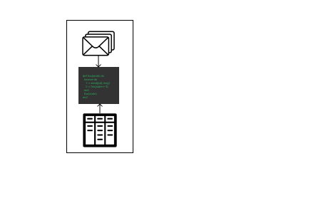
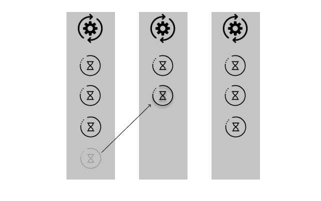
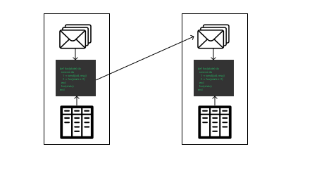
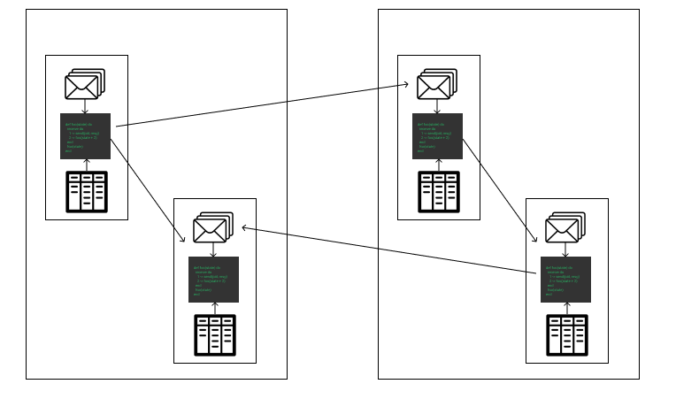
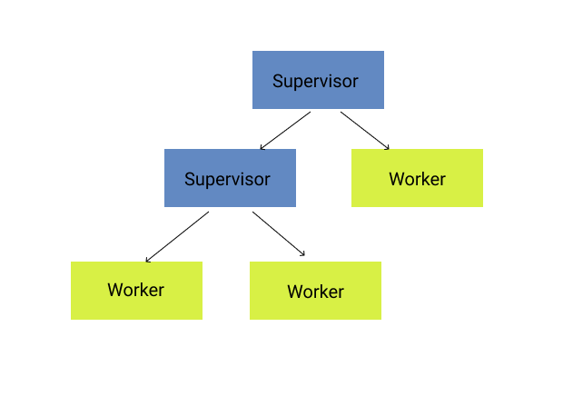

# Elixir

A language for BEAM
(Bogdan's/Björn's Erlang Abstract Machine)

---

## Why Elixir

 - An alternative language for BEAM
 - Additional standard libraries
 - Great tooling

---

## BEAM

 - A virtual machine for Erlang
 - Developed at Ericsson in 1986
 - Made for running telephone switches

---

## Telephone? What?

 - High number of concurrent events
 - Lot's of IO
 - Fault tolerance
 - High uptime requirements
 - Distributed system
 - Low latency requirements

---

## How BEAM achieves this

 - Lightweight processes
   - Can't block the scheduler
   - Work stealing
 - Isolated processes
   - Communication by messages
   - No shared memory
   - Immutable memory (i.e. functional)
 - Process monitoring and restarting
   - "Let it crash!"

---

#### Process

---

#### Scheduler

---

#### Isolation

---

#### Isolation -> Distributed

---

#### Monitoring

---

## Why learn Elixir (or any BEAM language)

 - Learn new patterns of programming
 - Bring with you this into other projects you work on
 - Any advanced C program contains a crappy, buggy version of BEAM

---

## Some code
